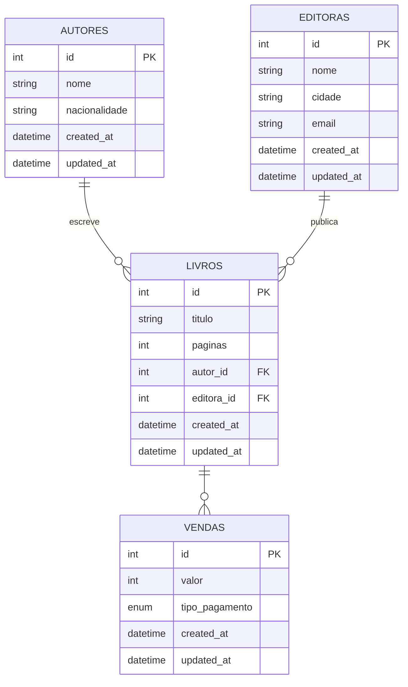

# Curso de Testes Automatizados em APIs Node - Alura

## Domínio

Livraria com sistema de cadastro e manejo de livros, autores, editoras, e compra de livros.

## Modelagem



## Design da API (Inicial)

### Autores

- POST /autores → cadastrar novo autor.
- GET /autores → listar todos os autores.
- GET /autores/:id → buscar autor por id.

### Editoras

- POST /editoras → cadastrar nova editora.
- GET /editoras → listar todas as editoras.
- GET /editoras/:id → buscar editora por id.

### Livros

- POST /livros → cadastrar novo livro (vinculado a autor e editora via FKs).
- GET /livros → listar todos os livros.
- GET /livros/:id → buscar livro por id.

## Design da API (Completo)

### Autores

- GET /autores → listar todos os autores.
- GET /autores/:id → buscar autor por id.
- GET /autores/:id/livros → listar livros de um autor específico.
- POST /autores → cadastrar novo autor.
- PUT /autores/:id → atualizar autor existente.
- DELETE /autores/:id → excluir autor.

### Editoras

- GET /editoras → listar todas as editoras.
- GET /editoras/:id → buscar editora por id.
- GET /editoras/:id/livros → listar livros de uma editora específica.
- POST /editoras → cadastrar nova editora (com validação de corpo vazio).
- PUT /editoras/:id → atualizar editora existente.
- DELETE /editoras/:id → excluir editora.

### Livros

- GET /livros → listar todos os livros.
- GET /livros/:id → buscar livro por id.
- POST /livros → cadastrar novo livro (vinculado a autor e editora via FKs).
- PUT /livros/:id → atualizar livro existente.
- DELETE /livros/:id → excluir livro.

### Vendas

- POST /vendas → registra uma nova venda

```json
{
  "idLivro": 1,
  "valor": 100,
  "modoPagamento": "CARTAO_CREDITO"
}
```
